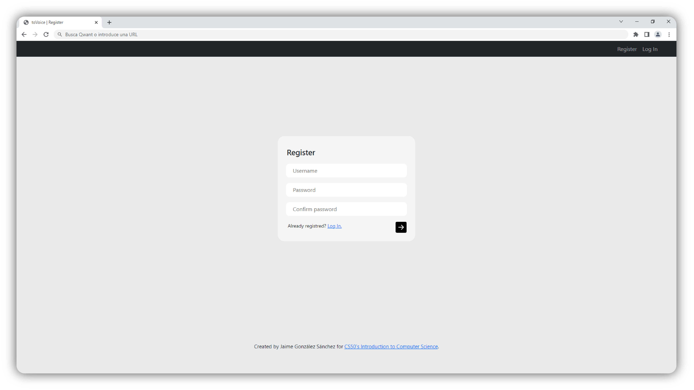
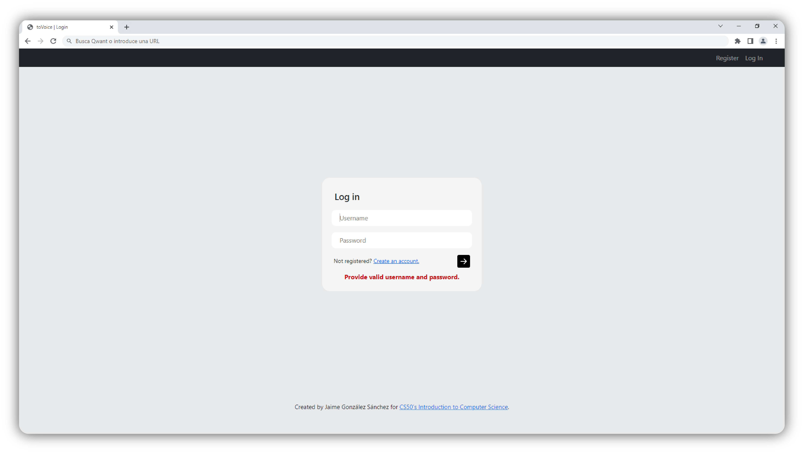
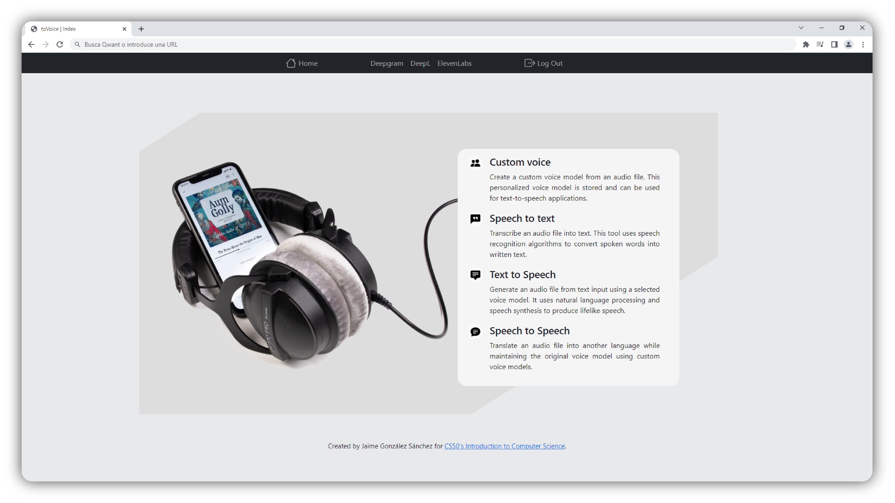
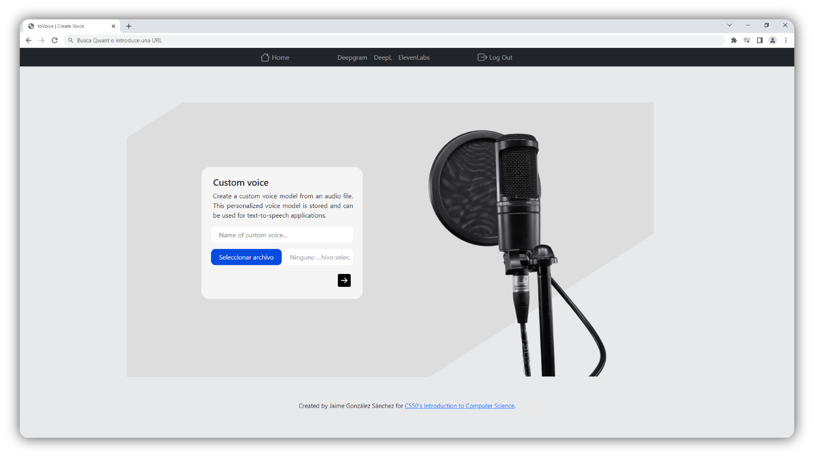
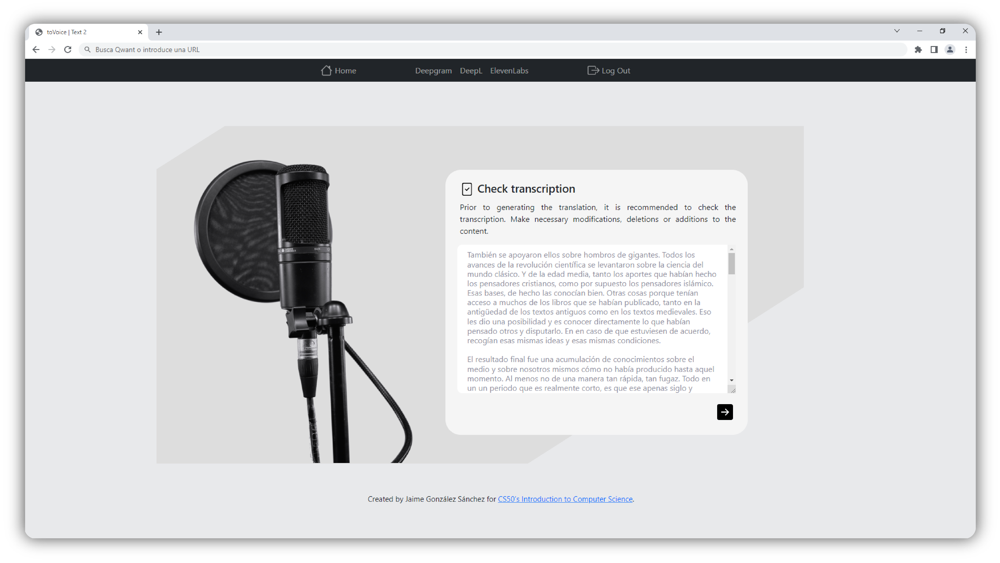
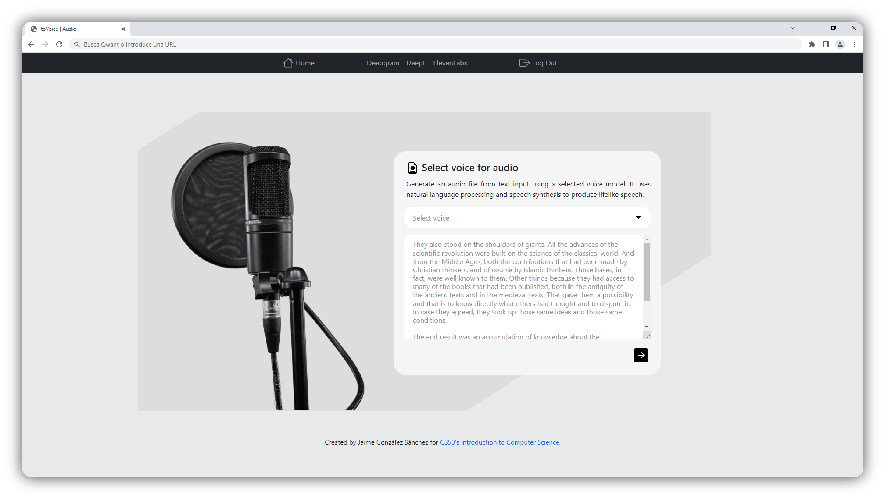
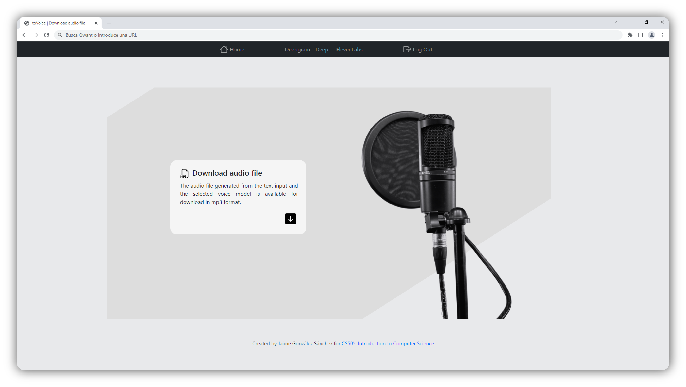

# toVoice

### Video Demo:  <https://youtu.be/pp8xZK4nHvI>

### Description:

toVoice is a web-based application that allows the creation of a custom voice model and its use in speech-to-text, text-to-speech and speech-to-speech functionalities. HTML, CSS, JavaScript, Python (Flask framework) and SQL were used for its development, as well as some Bootstrap elements.

Various APIs have been integrated for its usage: Deepgram API for transcription, ElevenLabs API for generation of customized speech model and reading from text and DeepL API for translation included in speech-to-speech function.

### How to use

First, the libraries referenced in [requirements.txt](/requirements.txt) must be installed.

You must also obtain the necessary API KEYs.

- Deepgram: [https://console.deepgram.com/signup](https://console.deepgram.com/signup)
- ElevenLabs [https://beta.elevenlabs.io/sign-up](https://beta.elevenlabs.io/sign-up)
- DeepL [https://www.deepl.com/es/pro-api?cta=header-pro-api/](https://www.deepl.com/es/pro-api?cta=header-pro-api/)

Once you have the API KEYS, you need to set them in the file [app.py](/app.py) (replace 123456789 with your API_KEY).

```
# Asign API KEYs
DEEPGRAM_KEY = '123456789'

ELEVENLABS_KEY = '123456789'

DEEPL_KEY = "123456789"
```

# Key features

## Registration / Login

In order to use the application, users must create an account. Through this account, the user will be able to create and save custom voice models.
A username and password are required for registration. Although the password is hashed before it is stored, for security reasons you should use a password that is not used elsewhere. In this form, as in the rest of the forms used on the web, flash messages are displayed if the user enters incorrect values or leaves fields blank.




## Index

On the main page there is an index with the different options available and a short description of each one: Custom Voice, Speech to Text, Text to Speech and Speech to Speech. There is also a navigation bar that appears on all pages. It can be used to return to the home page, access the API web pages, or log out.



## Custom voice

Users can create custom voice models from an audio file. According to the terms of the API used (ElevenLabs), the uploaded audio files must be in mp3 format and must not exceed 10MB in size. As a reference, the audio should be no longer than four minutes. This is enough to generate the speech model. Only the voice of one person should be heard in the audio.



## Speech to Speech

Users can translate an audio into another language while maintaining a similar voice to the original. In this case, the application is configured so that the translation is Spanish to English. It works by combining the speech-to-text, translation and text-to-speech functions.

In principle, the Speech-to-Text utility (Deepgram API) has no weight limit for the audio file to be transcribed. However, there is a limit of 5000 characters per request for the Text-to-Speech tool (ElevenLabs API). Due to this limitation, it is recommended not to use audio files longer than 4 minutes.

First, the original audio file is uploaded for transcription.


Once the transcription is complete, the user can check its quality and correct any errors.



Once the text has been translated, the user selects the voice model to be used to create the audio file. It is possible to use standard voice models provided by ElevenLabs (Bella, Antoni) or those created by the user.



Finally, the user can download the audio file.



## Speech to Text & Text to Speech

These options contain the above functions independently. Speech-to-Text allows you to transcribe an audio file and create a text file. Text to Speech allows you to create an audio file from text and select a standard or custom speech model. The pictures in the previous section serve as a reference for these options.


# Credits

Microphone photo by on Saubhagya gandharv on Unsplash. [https://unsplash.com/es/@jukkaaalho](https://unsplash.com/es/@jukkaaalho)

Headphones photo by on Jukka Aalho on Unsplash. [https://unsplash.com/es/@saubhagya2304](https://unsplash.com/es/@saubhagya2304)
